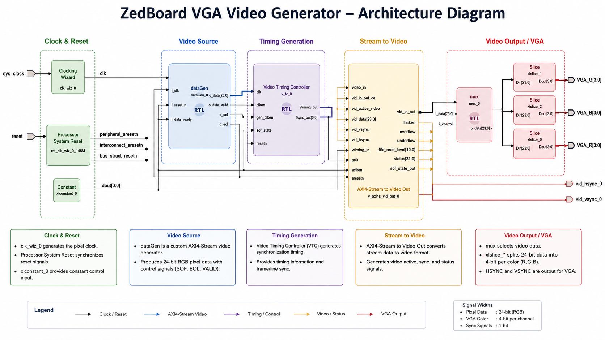
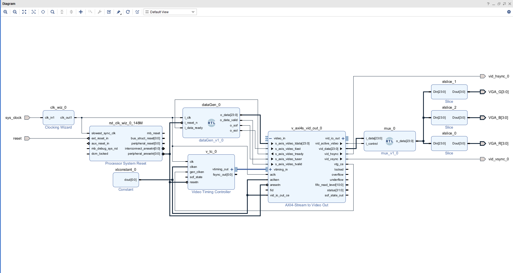

# ZedBoard VGA Video Generator

A simple FPGA-based VGA video generator for the **ZedBoard (Zynq-7000)** implemented in **Vivado IP Integrator**. The design generates video data using a custom AXI4-Stream source and displays it through the VGA interface.



## Overview

This project demonstrates:

- Clock generation using Vivado Clocking Wizard
- System reset synchronization
- Custom AXI4-Stream video source (`dataGen`)
- Video timing generation using Video Timing Controller (VTC)
- AXI4-Stream to Video Output conversion
- RGB signal extraction for VGA output
- VGA synchronization signal generation

The design outputs 24-bit RGB video through the ZedBoard VGA interface.

---

## Vivado Block Diagram



### Main Components

| Module | Description |
|----------|------------|
| `clk_wiz` | Generates the required pixel clock |
| `proc_sys_reset` | Handles reset synchronization |
| `dataGen` | Custom AXI4-Stream video data generator |
| `v_tc` | Video Timing Controller |
| `v_axi4s_vid_out` | Converts AXI4-Stream video to parallel VGA signals |
| `mux` | Video data selection/control |
| `xlslice` | Extracts RGB channels from 24-bit pixel data |

---


### Video Path

1. `dataGen` generates 24-bit RGB pixel data.
2. Data is streamed using AXI4-Stream protocol.
3. `Video Timing Controller` generates synchronization timing.
4. `AXI4S Video Out` converts the stream into VGA-compatible signals.
5. RGB channels are separated and routed to the VGA connector.

---

## Interfaces

### Inputs

| Signal | Description |
|----------|------------|
| `sys_clock` | Board system clock |
| `reset` | Active-high system reset |

### Outputs

| Signal | Width |
|----------|-------|
| `VGA_R` | 4 bits |
| `VGA_G` | 4 bits |
| `VGA_B` | 4 bits |
| `vid_hsync` | 1 bit |
| `vid_vsync` | 1 bit |

---

## AXI4-Stream Signals

The custom video generator implements the standard AXI4-Stream Video interface:

| Signal | Description |
|----------|------------|
| `tdata[23:0]` | RGB pixel data |
| `tvalid` | Pixel data valid |
| `tready` | Downstream ready |
| `tuser` | Start of frame |
| `tlast` | End of line |

---

## Requirements

### Hardware

- ZedBoard (Zynq-7000 XC7Z020)
- VGA monitor
- VGA cable

### Software

- Vivado 2023.2
- Xilinx IP Catalog

---

## Building the Design

### 1. Clone the Repository

```bash
git clone https://github.com/VaishnaviMudaliar/zedboard-vga-video-generator.git
cd zedboard-vga-video-generator
```

---

### 2. Create a New Vivado Project

1. Launch Vivado.
2. Select **Create Project**.
3. Enter a project name and location.
4. Select **RTL Project**.
5. Leave **Do not specify sources at this time** unchecked.
6. Click **Next**.

---

### 3. Add Design Sources

1. In the **Add Sources** window, click **Add Files**.
2. Navigate to the repository's `rtl/` directory.
3. Select all Verilog source files.
4. Click **Finish**.

Example:

```text
zedboard-vga-video-generator/
├── rtl/
│   ├── dataGen.v
│   ├── mux.v
│   └── ...
```

---

### 4. Add Constraints

1. In the **Add Constraints** step, click **Add Files**.
2. Select the constraint file from:

```text
constraints/zedboard.xdc
```

3. Click **Finish**.

---

### 5. Select the Target Device

Choose the ZedBoard device:

```text
xc7z020clg484-1
```

or select:

```text
Boards → ZedBoard (Zynq-7000)
```

if the board files are installed.

---

### 6. Recreate the Block Design

1. Open **IP Integrator**.
2. Create a new Block Design.
3. Add the required IP cores:

   - Clocking Wizard
   - Processor System Reset
   - Video Timing Controller (VTC)
   - AXI4-Stream to Video Out
   - Constant
   - Slice IPs

4. Add the custom RTL modules:

   - `dataGen`
   - `mux`

5. Connect the blocks according to the architecture diagram shown above.

---

### 7. Generate Output Products

After completing the block design:

```text
Right Click Block Design
    → Generate Output Products
```

Then:

```text
Right Click Block Design
    → Create HDL Wrapper
```

Select:

```text
Let Vivado manage wrapper and auto-update
```

---

### 8. Run Synthesis

```text
Flow Navigator → Run Synthesis
```

Resolve any warnings or errors before proceeding.

---

### 9. Generate Bitstream

```text
Flow Navigator → Generate Bitstream
```

This process may take several minutes.

---

### 10. Program the FPGA

1. Connect the ZedBoard via JTAG.
2. Power on the board.
3. Open:

```text
Hardware Manager → Open Target → Auto Connect
```

4. Select the detected device.
5. Click:

```text
Program Device
```

6. Choose the generated `.bit` file.

---

### 11. Verify VGA Output

Connect a VGA monitor to the ZedBoard and verify that the generated video pattern appears correctly.
---
## Repository Structure

```text
.
├── rtl/
│   ├── dataGen.v
│   ├── mux.v
│  
├── bd/
│   └── vgaInterface.bd
├── constraints/
│   └── constraints.xdc
├── docs/
│   └── vga_block_diagram.png
└── README.md
```

---

## Future Improvements

- Test pattern generation
- Frame buffer support using DDR memory
- HDMI output
- Dynamic resolution selection
- Hardware sprites and graphics acceleration


---

## License

MIT License

